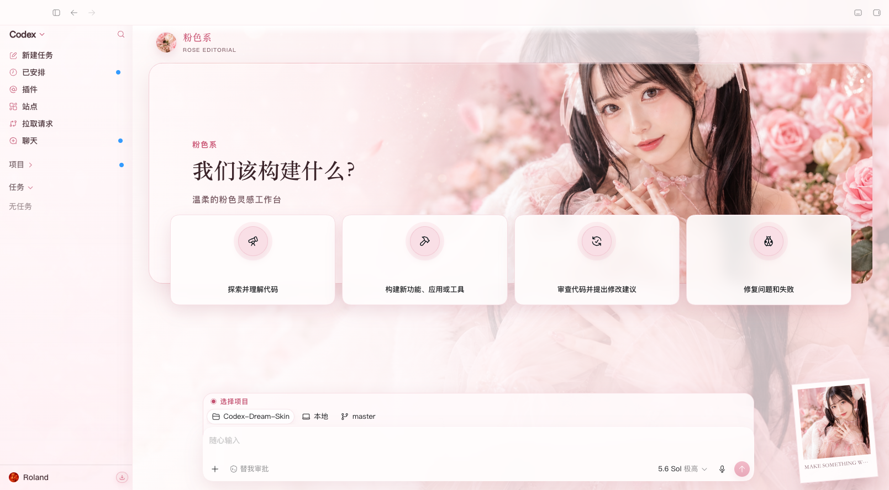
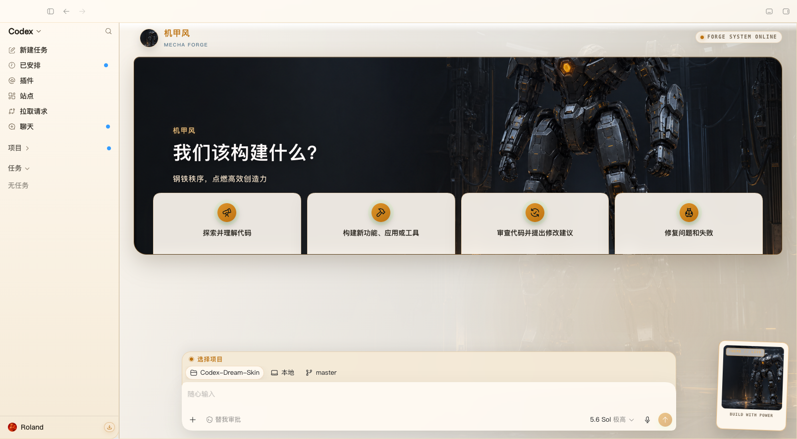
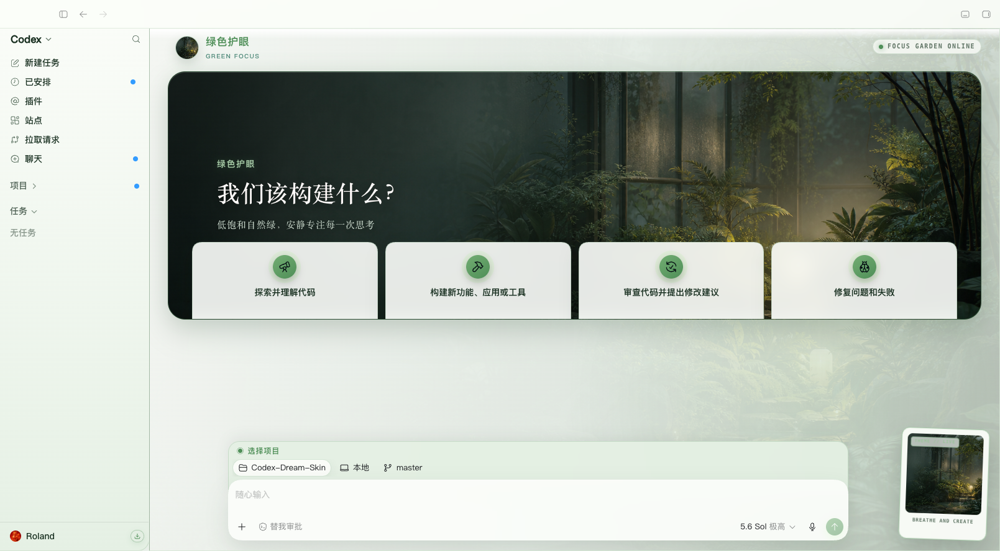
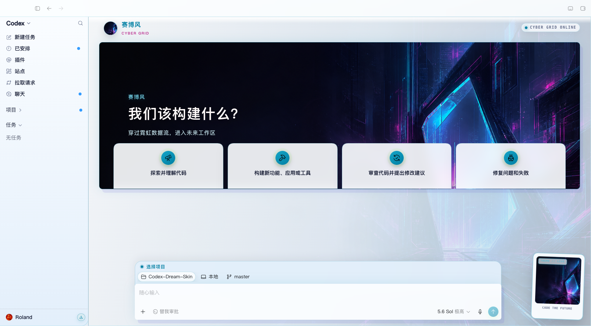
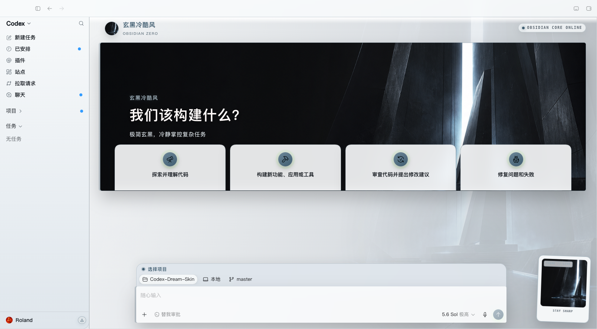

# Codex Dream Skin

<p align="center">
  <strong>中文</strong> · <a href="./README.en.md">English</a>
</p>

<p align="center">
  <strong>给 Codex 桌面端换上你喜欢的主题。</strong><br>
  保留原来的项目、任务、输入框和所有操作，只改变界面外观。
</p>

<p align="center">
  非 OpenAI 官方产品。本项目不会修改官方 <code>.app</code>、<code>app.asar</code>、WindowsApps 或代码签名。
</p>

> **Mac 新手只看这一句：**先打开一次官方 Codex，然后进入 [`macos`](./macos/) 文件夹，双击 **`Generate Codex Dream Skin.command`**，按窗口提示选择图片即可。

## 这是什么？

Codex Dream Skin 是一个 Codex 桌面端换肤工具。它可以：

- 给首页、侧栏、建议卡片和输入区换上统一主题；
- 使用内置的 5 套主题，也可以选择自己的图片生成主题；
- 保留 Codex 原有按钮和输入框，换肤后仍然可以正常点击和输入；
- 随时一键恢复官方外观；
- 通过本机回环地址注入样式，不修改官方安装包。

## 先选择你的系统

| 系统 | 当前状态 | 从哪里开始 |
| --- | --- | --- |
| macOS（Apple 芯片或 Intel） | 推荐，功能完整 | [`macos/`](./macos/) |
| Windows | 实验性支持，作者暂无 Windows 实机持续验证 | [`windows/`](./windows/) |

下面先介绍最常用的 **macOS 图形化安装方式**，不需要编程基础，也不需要自己安装 Node.js。

## macOS：第一次安装

### 1. 安装并打开一次官方 Codex

先确认官方 Codex Desktop 已经安装，并至少正常打开过一次。首次打开后，Codex 会创建换肤工具需要读取的配置文件。

如果还没有登录，也可以先完成登录再继续。

### 2. 保留完整项目文件夹

如果你是从 GitHub 下载的 ZIP：

1. 解压 ZIP；
2. 不要只复制图片、CSS 或单个 `.command` 文件；
3. 打开解压后的 `Codex-Dream-Skin` 文件夹；
4. 再打开里面的 [`macos`](./macos/) 文件夹。

脚本、主题和图片需要放在一起，缺少其中任何一部分都可能无法运行。

### 3. 双击一键生成入口

双击：

```text
Generate Codex Dream Skin.command
```

它会自动完成安装、图片处理、主题应用和结果检查。运行过程中：

1. 在弹出的文件选择窗口中选择一张图片；
2. 输入一个主题名称；
3. 如果提示需要重启 Codex，确认重启；
4. 等待终端显示完成，Codex 会以新主题打开。

如果暂时不想使用自己的图片，也可以双击：

```text
Install Codex Dream Skin.command
```

它会安装工具并使用项目自带的默认主题启动。

### 4. 以后如何启动

安装完成后，桌面会生成几个快捷入口：

| 桌面文件 | 用途 |
| --- | --- |
| `Codex Dream Skin.command` | 日常启动带皮肤的 Codex |
| `Codex Dream Skin - Generate.command` | 选择新图片并生成新主题 |
| `Codex Dream Skin - Customize.command` | 修改当前主题 |
| `Codex Dream Skin - Verify.command` | 检查主题并在桌面保存验证截图 |
| `Codex Dream Skin - Restore.command` | 恢复官方外观 |

以后想使用皮肤时，双击桌面的 **`Codex Dream Skin.command`** 即可。直接从官方图标启动 Codex 时，皮肤可能不会自动注入。

仓库里的 [`Start Codex Dream Skin.command`](./macos/Start%20Codex%20Dream%20Skin.command) 也可以启动，但必须先完成安装。

## macOS：切换 5 套内置主题

内置主题包括：

- 粉色系
- 机甲风
- 绿色护眼
- 赛博风
- 玄黑冷酷风

### 方法一：菜单栏切换（适合新手）

在 [`macos`](./macos/) 文件夹中双击：

```text
Install Menu Bar.command
```

安装完成后，屏幕右上角会出现 **🎨 Skin**。点击它就能切换主题、立即切换下一套主题，或开启每 30 分钟自动轮换。

菜单栏功能依赖 [SwiftBar](https://github.com/swiftbar/SwiftBar)。如果电脑已经安装 Homebrew，脚本可以自动安装 SwiftBar；否则会提示你先手动安装。

### 方法二：复制命令切换

打开“终端”，复制下面任意一条命令并按回车：

```bash
~/.local/bin/codex-dream-skin list
~/.local/bin/codex-dream-skin use 粉色系
~/.local/bin/codex-dream-skin use 机甲风
~/.local/bin/codex-dream-skin use 绿色护眼
~/.local/bin/codex-dream-skin use 赛博风
~/.local/bin/codex-dream-skin use 玄黑冷酷风
```

自动轮换：

```bash
~/.local/bin/codex-dream-skin auto on
~/.local/bin/codex-dream-skin auto off
```

手动切换默认不会擅自重启 Codex。如果当前 Codex 不是通过皮肤入口启动，主题会先保存，等下次通过皮肤入口启动时应用。

## macOS：恢复官方外观

双击 [`macos/Restore Codex Dream Skin.command`](./macos/Restore%20Codex%20Dream%20Skin.command)，或双击桌面的：

```text
Codex Dream Skin - Restore.command
```

恢复脚本会停止主题注入、关闭自动轮换、还原安装前备份的外观配置，并正常重启 Codex。你的项目、任务记录、登录状态、插件和 Skill 不会被删除。

## 图片怎么选效果更好？

- 支持 PNG、JPEG、HEIC、TIFF、WebP；
- 建议图片小于 50 MB；
- 推荐使用横向 16:9 图片，宽度最好不低于 2000 像素；
- 左侧尽量简洁，因为 Codex 的标题和按钮通常显示在左侧；
- 主体放在中间偏右的位置效果通常更好；
- 尽量不要使用带大量文字、水印、假按钮或软件界面的图片。

竖图和方图也可以使用，工具会自动降低任务页面背景的存在感，尽量保证文字可读。

## 效果预览

下面是 5 套主题的实际方向。主题只改变视觉样式，不会把图片中的示意文字或内容写进你的 Codex。

<p align="center">
  <br>
  <sub>粉色系</sub>
</p>

<p align="center">
  <br>
  <sub>机甲风</sub>
</p>

<p align="center">
  <br>
  <sub>绿色护眼</sub>
</p>

<p align="center">
  <br>
  <sub>赛博风</sub>
</p>

<p align="center">
  <br>
  <sub>玄黑冷酷风</sub>
</p>

## 常见问题

### 双击 `.command` 后 macOS 不允许打开

在 Finder 中右键该文件，选择 **“打开”**，然后在确认窗口中再次选择 **“打开”**。只运行你从可信来源获得的项目文件。

### 提示找不到 Codex 配置

先正常打开一次官方 Codex，等待首页加载完成，再关闭 Codex 并重新运行安装脚本。

### 提示“请先完成安装”

先双击 `Generate Codex Dream Skin.command` 或 `Install Codex Dream Skin.command`，安装成功后再使用 Start、Customize、Verify 或 Restore。

### Codex 已经打开，但主题没有出现

Codex 可能是从官方图标启动的。请双击桌面的 `Codex Dream Skin.command`。如果询问是否重启 Codex，确认后等待重新打开。

### Codex 更新后主题失效

重新双击 `Generate Codex Dream Skin.command` 或 `Install Codex Dream Skin.command`。脚本会重新发现当前官方 Codex，并更新本机主题引擎。

### 如何确认是否安装成功？

双击桌面的 `Codex Dream Skin - Verify.command`。验证成功后，桌面会出现：

```text
Codex Dream Skin Verification.png
```

### 终端提示 `permission denied`

在项目根目录打开终端，执行：

```bash
chmod +x macos/*.command macos/scripts/*.sh
```

然后重新双击对应的 `.command` 文件。

### 仍然无法解决

运行诊断命令：

```bash
cd macos
./scripts/doctor-macos.sh
```

提交 Issue 时，请说明 macOS 版本、Codex 版本、执行了哪个入口，并附上终端最后一段报错。不要上传 API Key、`~/.codex/auth.json` 或包含隐私的截图。

## Windows：实验性使用方法

> 作者目前没有 Windows 主机进行持续实机验证。Windows 脚本保留了安装、启动、验证和恢复能力，但体验与 macOS 不完全相同，也暂不支持选择图片生成主题。

使用前请准备：

- 从 Microsoft Store 安装的官方 Codex；
- 至少正常打开过一次 Codex；
- 已安装 Node.js，并确保在 PowerShell 中执行 `node --version` 能看到版本号。

在解压后的项目目录中打开 PowerShell，然后执行：

```powershell
cd .\windows
powershell -NoProfile -ExecutionPolicy Bypass -File .\scripts\install-dream-skin.ps1
powershell -NoProfile -ExecutionPolicy Bypass -File .\scripts\start-dream-skin.ps1 -RestartExisting
```

安装脚本会在桌面和开始菜单创建 `Codex Dream Skin` 快捷方式。以后通过该快捷方式启动即可。

恢复官方外观：

```powershell
powershell -NoProfile -ExecutionPolicy Bypass -File .\scripts\restore-dream-skin.ps1 -RestoreBaseTheme
```

Windows 的详细说明和安全约束见 [`windows/SKILL.md`](./windows/SKILL.md)。

## 安全说明

主题功能通过 Chromium DevTools Protocol（CDP）连接官方 Codex：

- 只监听本机回环地址 `127.0.0.1`；
- 不修改官方应用、`app.asar`、WindowsApps 或代码签名；
- 不会改写 API Key、模型供应商或 Base URL；
- 只备份并调整必要的外观配置，恢复时可以还原；
- CDP 本身权限较高，主题运行期间不要运行来历不明的本机程序；不使用皮肤时可以执行 Restore。

## 给进阶用户

macOS 一条命令生成主题：

```bash
cd macos
./scripts/generate-dream-skin-macos.sh \
  --image "/绝对路径/你的图片.png" \
  --name "我的主题"
```

更多资料：

- [macOS 完整说明](./macos/README.md)
- [平台路径和能力对照](./docs/platforms.md)
- [项目结构和维护记录](./docs/PROJECT.md)
- [macOS 更新日志](./macos/CHANGELOG.md)
- [反馈 Issue 模板](./.github/ISSUE_TEMPLATE/)

## 许可与声明

- 项目采用 MIT 许可，详见 [`macos/LICENSE`](./macos/LICENSE)；
- 其他声明见 [`macos/NOTICE.md`](./macos/NOTICE.md)；
- 本项目与 OpenAI 无关联，Codex 及相关商标归其权利人所有；
- 预览图中的人物或 IP 形象仅用于主题示意，公开再分发或商用前请自行确认授权。

---

如果这个项目帮到了你，欢迎点一个 Star。然后挑一张喜欢的图片，让 Codex 变成你每天愿意打开的样子。
