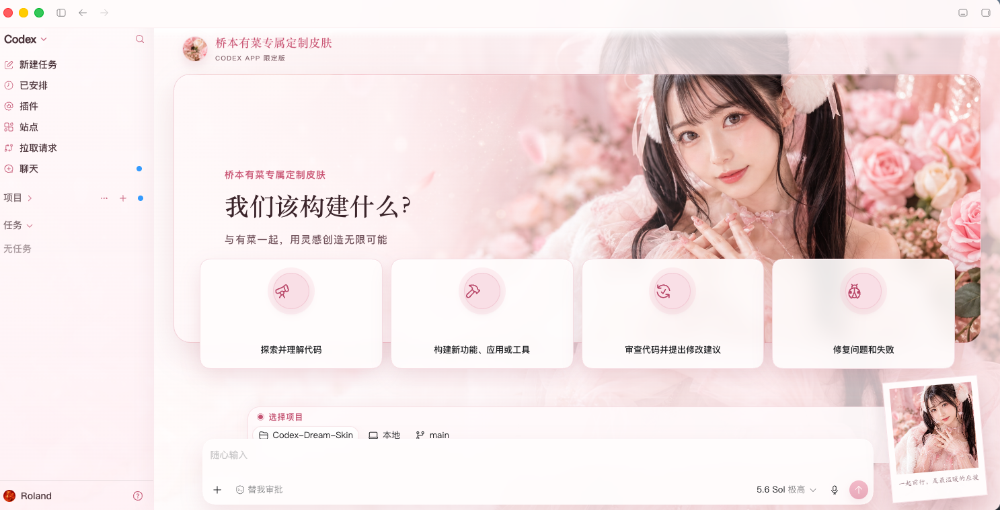

# Codex Dream Skin

  <strong>中文</strong> · <a href="./README.en.md">English</a>

  <strong>给 Codex 桌面端换一张会呼吸的脸。</strong> 
  外部主题 / 换肤工具 · 本机 CDP 注入 · 不改官方安装包

  一张图，一种心情 · 写代码，也要有氛围感

  非 OpenAI 官方产品。不修改 <code>.app</code> / <code>app.asar</code> / WindowsApps。

## 赞助商

  <a href="https://github.com/Fei-Away/Codex-Dream-Skin">
    基于codex-dream-skin调整，感谢🙏开源
  </a>

  <strong>更智能的连接 · 更热爱的创造</strong> 
  热爱驱动 · 无限可能 · Connect AI · Power Creation

  
    换肤。
  

## 效果预览

一张图，一种心情。下面是视觉方向合成图；实际皮肤会保留你当前 Codex 的真实侧栏、项目、任务和系统窗口框架，不会把示意数据写进应用。macOS 1.4.0 的 Skill 会先按素材选择完整设计母版，再用实时截图对照初版验收，不再只做取色和铺背景。

   
  粉系定制

## 它能做什么

- **真·可交互**：侧栏、建议卡、项目选择、输入框都是原生控件，不是整窗假截图贴上去
- **可换图**：换一张喜欢的图，就能变成你的主题
- **五主题轮换**：macOS 内置粉色、机甲、护眼绿、赛博、玄黑五套主题，背景、侧栏、建议卡、输入区和右下角主题卡会一起切换；可每 30 分钟自动切换，也可用 `codex-dream-skin` 命令手动切换
- **可恢复**：一键还原官方外观
- **相对安全**：本机回环 CDP 注入，不改官方二进制与签名

## 快速开始

仓库内按平台放了现成脚本（实现细节不同，效果都是「主题化 Codex」）：

| 平台                      | 目录                     | 入口                                                      |
| ------------------------- | ------------------------ | --------------------------------------------------------- |
| Apple Silicon / Intel Mac | [`macos/`](./macos/)     | 双击 `Generate Codex Dream Skin.command`                  |
| Windows                   | [`windows/`](./windows/) | `scripts/install-dream-skin.ps1` → `start-dream-skin.ps1` |

更细的说明：

- Mac：[`macos/README.md`](./macos/README.md)
- Windows：[`windows/SKILL.md`](./windows/SKILL.md)
- 路径对照：[`docs/platforms.md`](./docs/platforms.md)
- 项目记录：[`docs/PROJECT.md`](./docs/PROJECT.md)

## 反馈与贡献

- **Issue：** 请用 [Issue 模板](./.github/ISSUE_TEMPLATE/)（Bug / 功能）；已关闭空白 Issue。提交前建议先跑 Verify / Restore 自检。
- **PR：** 请按 [PR 模板](./.github/pull_request_template.md) 写清改动，并勾选对应自测（如 `macos/tests/run-tests.sh`、verify / restore）。

## 安全边界

- CDP 只绑 `127.0.0.1`，主题运行期间勿跑来路不明的本机程序
- 不修改官方安装目录与代码签名
- **不会**自动改写 API Key / Base URL；中转与换肤分开

## 许可与声明

- 见 [`macos/LICENSE`](./macos/LICENSE)（MIT）与 [`macos/NOTICE.md`](./macos/NOTICE.md)
- 非 OpenAI 官方产品；Codex 及相关权利归其权利人
- 效果图中的人物 / IP 形象仅作主题示意；商用或公开再分发请自行确认肖像权与商标授权

---

Star 一下，然后挑一张图，把你的 Codex 变成今天想要的样子。
